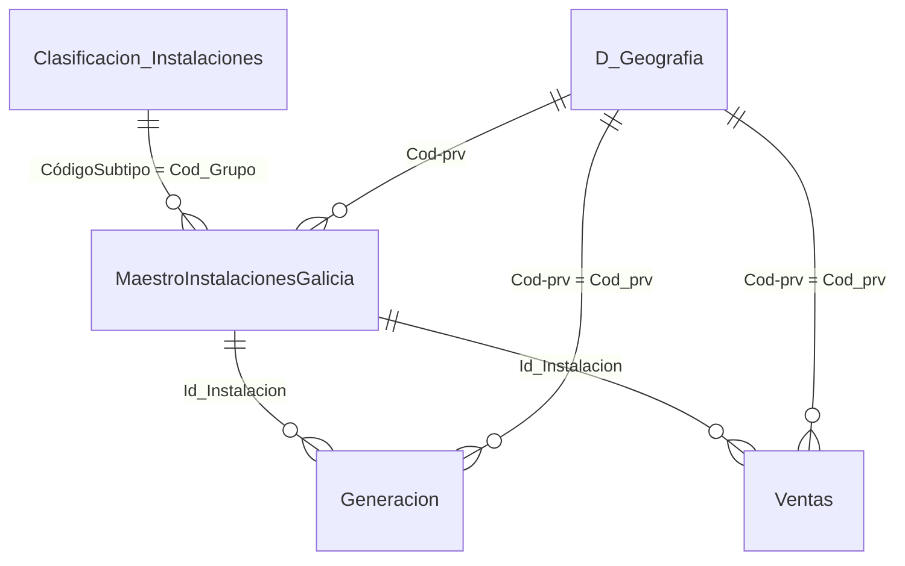

# Gold · Modelo semántico

Tablas finales del modelo semántico, en esquema en estrella. Cubren **199 instalaciones eólicas de Galicia** (instalación + fase), con datos mensuales de **2023 a 2025**.

## Dimensiones (`Dim/`)

| Tabla | Filas | Clave | Contenido |
|---|---|---|---|
| `MaestroInstalacionesGalicia.xlsx` | 199 | `Id_Instalacion` | Una fila por instalación y fase: propietario, municipio, provincia, grupo normativo, potencia, fecha de inscripción y tecnología (nº de aerogeneradores, fabricante, modelo, potencia unitaria). |
| `Clasificación Instalaciones.xlsx` | 20 | `CódigoSubtipo` | Clasificación normativa de las instalaciones: categoría → grupo → subtipo → tecnología. |
| `D_Geografia.xlsx` | 52 | `Cod-prv` | Provincias y comunidades autónomas (códigos INE). |
| `EmpresasContratistas.xlsx` | 30 | `Id` | Empresas de O&M del sector eólico (OEM, ISP, especialistas, componentes) con sus servicios y relevancia. |

## Hechos (`Fact/`)

| Tabla | Filas | Clave | Grano | Medidas |
|---|---|---|---|---|
| `Generacion_parques_eolicos_Galicia.xlsx` | 7.164 | `Id_Generacion` | Instalación × mes | `Energia_generada_gwh` |
| `Ventas_parques_eolicos_Galicia.xlsx` | 7.164 | `Id_Ventas` | Instalación × mes | `Energia_vendida_gwh`, `Potencia_instalada_mw`, `Precio_mercado_mwh_euro`, `Ingresos_estimados_euro` |

Las claves de hechos tienen el formato `Id_Instalacion_Año_Mes`, por ejemplo `RE-000845-1_2025_1`.

## Relaciones

| Desde | Hacia | Columnas |
|---|---|---|
| `Generacion` / `Ventas` | `MaestroInstalacionesGalicia` | `Id_Instalacion` |
| `MaestroInstalacionesGalicia` | `Clasificación Instalaciones` | `Cod_Grupo` → `CódigoSubtipo` |
| `MaestroInstalacionesGalicia` | `D_Geografia` | `Cod-prv` |
| `Generacion` / `Ventas` | `D_Geografia` | `Cod_prv` → `Cod-prv` |

La integridad referencial se ha comprobado: todas las claves de los hechos existen en sus dimensiones.

`EmpresasContratistas` no tiene una clave común con el resto de tablas. En la [ontología](../../Ontologia) está definida como entidad (*Contratistas*), pero de momento sin relaciones.

## Notas

- La calendarización está en los propios hechos (`Ejercicio`, `Codigo_Mes`, `Mes`, `Fecha`). Si se necesita, se puede añadir una tabla calendario en el modelo.
- `Potencia_unitaria_kw` es texto en las instalaciones con configuraciones mixtas (p. ej. `43×660; 1×850`).
- Generación, ventas e ingresos son **datos sintéticos** para la demo (ver [`Raw/readme.md`](../Raw/readme.md)).
