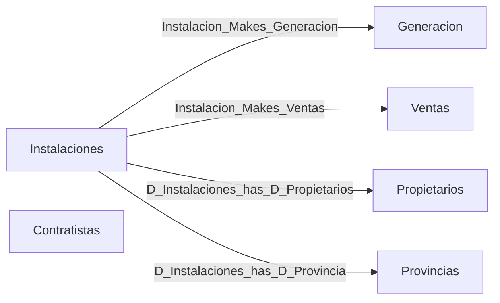

# Ontología · Eólicas en Galicia

Capa ontológica creada en **Microsoft Fabric (Fabric IQ)** sobre las tablas de [`Data/Gold`](../Data/Gold), cargadas en el Lakehouse `dlh_eolicas_galicia`.

- **Ontología:** `Ontology_Eolicas_Galicia`
- **Modelo semántico de origen:** *Modelo Eolicas Galicia* (ver [`/Demo`](../Demo))

## Entidades

| Entidad | Clave | Tabla del Lakehouse (esquema `gold`) | Tabla en este repo |
|---|---|---|---|
| **Instalaciones** | `Id_Instalacion` | `D_Instalaciones` | `Data/Gold/Dim/MaestroInstalacionesGalicia.xlsx` |
| **Propietarios** | `Id_Propietario` | `D_Propietarios_Instalaciones` | Propietarios únicos del Maestro |
| **Provincias** | `cod-prv` | `D_Provincias` | `Data/Gold/Dim/D_Geografia.xlsx` |
| **Generacion** | `Id_Generacion` (instalación · año · mes) | `F_Generacion_Eolicas` | `Data/Gold/Fact/Generacion_parques_eolicos_Galicia.xlsx` |
| **Ventas** | `Id_Venta` (instalación · año · mes) | `F_Ventas_Eolicas` | `Data/Gold/Fact/Ventas_parques_eolicos_Galicia.xlsx` |
| **Contratistas** | `Id` | `D_Contratistas` | `Data/Gold/Dim/EmpresasContratistas.xlsx` |

Cada entidad tiene descripción, sinónimos (p. ej. *Propietarios*: Empresa, Titular, Responsable…) y un enlace al informe **Modelo Eolicas Galicia**, para que usuarios y agentes de IA entiendan el significado de los datos.

## Relaciones

`Contratistas` está definida como entidad pero, por ahora, **no tiene relaciones** con el resto.

## Guía: crear y mantener una ontología en Fabric

Paso a paso con capturas, también disponible en Word: [`Ontologias_en_Fabric.docx`](Ontologias_en_Fabric.docx).

### Creación de ontologías en Fabric

¿Cómo dar de alta ontologías en Fabric? Hay dos formas:

- Desde un nuevo elemento / Item de Fabric, llamado “Ontology”

- Desde un modelo semántico ya existente.

**Opción 1: Alta de un nuevo elemento de Fabric tipo “Ontology”**:

Resultado final:

**Opción 2: Generación de una ontología desde un modelo semántico ya existente**:

Resultado final:

### Mantenimiento de ontologías en Fabric

#### Configuración de una Entidad

### Cambio de nombre y propiedades de una entidad

Para cambiar el nombre de una Entidad en Fabric, es necesario seleccionar la entidad a modificar y pinchar “Ver detalles del tipo de entidad”:

A continuación, seleccionamos los 3 puntos de la derecha y pinchamos en “Cambiar nombre”:

Resultado final:

Nota: Esto es interesante cuando creamos ontologías y relaciones partiendo de un modelo semántico ya existente, donde suele incluir el nombre de las tablas a las entidades que genera desde cero.

### Incluir enlaces a origen de datos que forman las Entidades

Para asociar un campo de una entidad a u su origen de datos, preferiblemente campos de tablas de un Data Lakehouse, es necesario realizar los siguientes pasos.

Primero, seleccionamos la opción “Agregar enlace y propiedades” dentro del desplegable de “Administrar enlaces de propiedad”:

A continuación, seleccionamos el tipo de enlace: o bien una tabla de Lakehouse, o tabla de centro de eventos o vista materializada:

Seleccionamos el origen del Lakehouse (en OneLake):

Navegamos hasta encontrar la tabla que queremos usar como enlace a los campos de las entidades:

Resultado final:

Otro ejemplo de enlace de datos para la entidad *Provincias*:

Seleccionamos también la opción “Tabla de Lakehouse” como tipo de enlace de datos:

En la siguiente imagen se visualiza el mapeo entre los campos de la tabla de origen de Lakehouse con las propiedades de la entidad *Provincias*:

Una vez que se han incluido los enlaces del origen de los datos en las propiedades de la Entidad, se puede incluir una descripción a cada propiedad para enriquecer el contexto y entendimiento de cada propiedad:

### Enriquecimiento de metadatos de Entidades

Dentro de la configuración de una Entidad, se puede incluir información sobre los metadatos de la entidad, para aportar contexto y significado a los datos, mediante descripciones, sinónimos y otra información relevante. Esto facilita su interpretación, descubrimiento y uso por parte de usuarios y agentes de IA.

Además, se pueden enlazar informes de Power BI o otros recursos relacionados con el contexto de la Ontología para enriquecer la información disponible y facilitar el acceso a contenido relevante desde un mismo punto, tal como se observa en la siguiente imagen:

Ejemplo para la entidad *Provincia*:

Ejemplo para la entidad *Propietarios*:

Ejemplo para la entidad *Instalaciones*:

#### Exploración de las Instancias de una entidad

Dentro del panel de Instancias, podemos ver una primera vista de registros de los campos de la tabla del Lakehouse que alimentan a las entidades de la ontologia:

#### Relaciones entre entidades

Relaciones entre entidades:

### Consumo de ontologías en Fabric

Hay diferentes tipos:

<https://learn.microsoft.com/es-es/fabric/iq/ontology/tutorial-4-create-data-agent>

Se va a crear con un agente de datos en Fabric:

### Tablas finales

#### Tabla final de generación

Tabla final de generación:

Detalles de la entidad Generación:

#### Tabla final de ventas

### Otras imágenes

